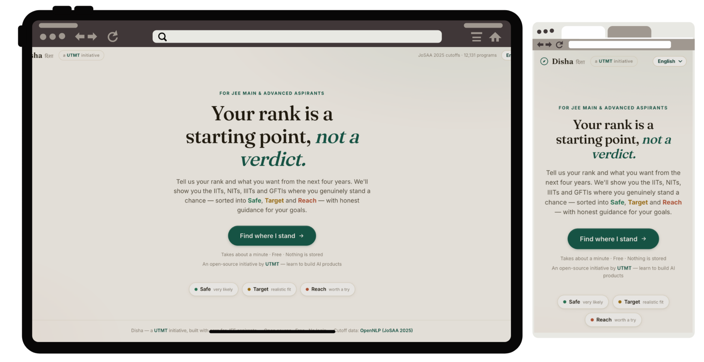

# Disha (दिशा) — JEE College Recommender

Disha is an open-source intelligent counselling pipeline and interactive portal designed to help JEE Main and Advanced aspirants navigate the complex JoSAA/CSAB seat allocation process. By inputting their ranks, gender, home state, and career aspirations, students receive a personalized, mathematically backed list of eligible college and branch options. Unlike static PDF cutoff tables, Disha groups recommendations into intuitive categories (Safe, Target, and Reach), calculates the statistical probability of admission based on historical volatility, and aligns choices with the student's personal career interests.



---

## Quick Start

### Running Locally (Python & Uvicorn)

1. **Set up a virtual environment and install dependencies**:
   ```bash
   # From the repository root
   python -m venv .venv
   source .venv/bin/activate   # On Windows: .venv\Scripts\activate
   pip install -r requirements.txt
   ```

2. **Run the FastAPI application**:
   ```bash
   uvicorn main:app --reload --port 8000
   ```

3. **Access the portal**:
   Open your browser and navigate to [http://127.0.0.1:8000](http://127.0.0.1:8000).
   The interactive API documentation is available at [http://127.0.0.1:8000/api/docs](http://127.0.0.1:8000/api/docs).

*Note: On Windows, you can also double-click the `run.bat` file in the root directory to automatically set up the virtual environment, install dependencies, and launch the server.*

### Running with Docker

*Note: The repository does not currently contain a `Dockerfile` or `docker-compose.yml` in the root. If you add them, the standard commands to build and run the application are:*

```bash
# Build the Docker image
docker build -t jee-recommender .

# Run the container
docker run -p 8000:8000 jee-recommender
```

---

## How It Works

### 1. The Student's Journey (An Intuitive Walkthrough)

To understand how Disha thinks, let’s follow **Rohan**, a student from **Rajasthan** who scored a **JEE Main CRL rank of 6,500** and is passionate about a **"Coding & software"** career. When Rohan submits his profile, Disha processes his request through five distinct stages:

*   **Stage 1: Filtering Out the Impossible**
    First, Disha looks at Rohan's exam type. Since he only entered a JEE Main rank, Disha immediately filters out all IITs (which require a JEE Advanced rank) and keeps NITs, IIITs, and GFTIs. Next, because Rohan is male, Disha filters out all female-only (supernumerary) seats. Finally, Disha checks the geographic quotas: since Rohan’s home state is Rajasthan, he gets the **Home State (HS)** quota at MNIT Jaipur, but falls under the **Other State (OS)** quota for NITs in other states (like NIT Trichy or NIT Warangal).
*   **Stage 2: Sorting into Buckets (Safe, Target, Reach)**
    Disha compares Rohan’s rank of 6,500 against last year's opening and closing ranks for every remaining branch:
    *   **Reach (Ambitious)**: For *Computer Science at MNIT Jaipur*, last year's home-state cutoff window was 3,200 (Opening) to 5,800 (Closing). Rohan's rank of 6,500 is slightly past the closing rank, but since it is within a 25% margin, Disha places it in his **Reach** bucket—it's tough, but cutoffs fluctuate, so it's worth a shot.
    *   **Target (Realistic)**: For *Computer Science at NIT Jalandhar*, the cutoff window was 6,200 to 9,500. Rohan's rank of 6,500 sits comfortably inside this range, making it a highly realistic **Target**.
    *   **Safe (Backups)**: For *Civil Engineering at NIT Kurukshetra*, the cutoff window was 12,000 to 22,000. Rohan's rank of 6,500 easily beats the opening rank of 12,000. However, because Rohan is *too* overqualified (his rank is less than half of the opening rank), Disha automatically prunes this option. This keeps Rohan's list clean and prevents him from wasting choices on branches far below his potential.
*   **Stage 3: Personalizing by Career Goal**
    Rohan selected "Coding & software". Disha looks at its internal career-weight mapping: Computer Science (CSE) gets a maximum interest weight of 10, Mathematics & Computing gets 9, ECE gets 6, while Civil Engineering gets 0. 
    Disha also calculates a brand score for each college (e.g., top-tier older NITs get a higher brand weight than newer ones). Since Rohan left the **Brand-vs-Branch Slider** at the default 50/50 setting, Disha blends the branch interest score and the college brand score to calculate a personalized **Interest Score** for every option.
*   **Stage 4: Calculating Admission Probability**
    Instead of just giving a binary "yes" or "no", Disha analyzes the historical volatility of cutoffs. If a branch's closing rank has fluctuated wildly over the last few years, Disha calculates a wider margin of error. Using this volatility, Disha estimates Rohan's actual chance of getting in: he has a **23.5% chance** for MNIT Jaipur CSE (Reach) and an **88.2% chance** for NIT Jalandhar CSE (Target).
*   **Stage 5: Designing the Final List**
    Finally, Disha sorts Rohan’s matches. It shows all his **Targets** first (sorted by his personalized interest score), followed by his **Reaches**, and then his **Safes**. For each card, it generates a natural explanation in his chosen language: 
    > *"Target for you – strong fit for your goal (Computer Science and Engineering at NIT Jalandhar). Your home-state quota gives roughly a 1,200-rank cushion. Cutoff has been fairly steady. (88.2% chance)"*

---

### 2. Technical Detail & Core Logic

This section outlines the exact mathematical formulas, thresholds, and variables implemented in the backend pipeline (`app/disha/recommender.py` and `app/disha/states.py`).

#### A. Rank Categorization Thresholds
For a student rank $R$, opening rank $OR$, and closing rank $CR$, the category is determined by the following constants:
*   `UPPER_MARGIN = 0.25` (Allows ranks up to 25% worse than last year's closing rank to be considered a **Reach**).
*   `LOWER_MARGIN = 0.50` (Prunes any option where the student's rank is more than 50% better than the opening rank to avoid overqualification).

$$\text{Category} = \begin{cases} 
\text{None (Pruned)} & \text{if } R < OR \times (1 - \text{LOWER\_MARGIN}) \\
\text{Safe} & \text{if } R \le OR \\
\text{Target} & \text{if } OR < R \le CR \\
\text{Reach} & \text{if } CR < R \le CR \times (1 + \text{UPPER\_MARGIN}) \\
\text{None (Dropped)} & \text{if } R > CR \times (1 + \text{UPPER\_MARGIN})
\end{cases}$$

#### B. Personalized Scoring (Tag-Weight Model)
Each academic program is mapped to a set of semantic tags (e.g., `cse`, `ece`, `math_computing`, `mechanical`) in `states.classify_branch()`. 

When a student selects a career goal, the branch interest score ($S_{\text{branch}}$) is the maximum weight assigned to the program's tags under that goal in `states.GOAL_TAG_WEIGHTS`:

```python
# Weights from states.py
GOAL_TAG_WEIGHTS = {
    "coding":     {"cse": 10, "math_computing": 9, "ai_ds": 9, "it": 8, "ece": 6, "electrical": 4},
    "research":   {"physics": 10, "bs_science": 9, "math_science": 9, "chemistry": 8, "math_computing": 7, "economics": 6, "cse": 5, "ece": 5, "materials": 5, "mechanical": 4, "chemical": 4},
    "mba":        {"economics": 8, "cse": 6, "math_computing": 6, "ece": 5, "mechanical": 5, "electrical": 5, "civil": 4, "chemical": 4},
    "core":       {"mechanical": 10, "civil": 9, "electrical": 9, "chemical": 9, "aerospace": 9, "materials": 8, "energy": 8, "production": 8, "ece": 6, "cse": 3},
    "undecided":  {"cse": 7, "ece": 7, "math_computing": 7, "ai_ds": 7, "electrical": 6, "mechanical": 6, "chemical": 5, "civil": 5, "it": 6, "economics": 5}
}
```

The institute brand score ($S_{\text{brand}}$) is determined by the tier of the college in `data_loader._brand_score()`:
*   **Old IITs** (`_OLD_IITS`): `1.0`
*   **Newer IITs**: `0.88`
*   **Top NITs** (`_TOP_NITS`): `0.78`
*   **Other NITs**: `0.68`
*   **IIITs**: `0.60`
*   **GFTIs**: `0.50`

The final interest score ($S_{\text{interest}}$) blends these two components using the user's brand-vs-branch ratio slider $\alpha \in [0.0, 1.0]$:

$$S_{\text{interest}} = (1 - \alpha) \times S_{\text{branch}} + \alpha \times (S_{\text{brand}} \times 10)$$

#### C. Admission Probability & Volatility
The probability of admission $P$ is calculated using a logistic sigmoid function of the Z-score:

$$P = \frac{1}{1 + e^{-1.7 \cdot z}} \times 100\%$$

Where the Z-score $z$ represents how many standard deviations the student's rank is from the closing rank:

$$z = \frac{CR - R}{\sigma}$$

*   **Volatility ($\sigma$)**:
    *   In **Extended Mode**, $\sigma$ is the standard deviation of the program's closing ranks across all historical years (2018–2025) in which it appeared.
    *   If the program has less than 2 years of historical data, or if running in **Basic Mode**, the volatility defaults to $8\%$ of the closing rank:
        $$\sigma = 0.08 \times CR$$
    *   To prevent unrealistically low volatility, a minimum floor is enforced:
        $$\sigma_{\text{min}} = \max(10, 0.05 \times CR)$$

#### D. Cutoff Confidence Bands
The stability of a cutoff window is classified based on its rank spread ($\text{spread} = CR - OR$):
*   **Fragile**: If $\text{spread} < 1,000$ ranks or if $CR \le OR$.
*   **High**: If $\text{spread} \ge 6,000$ ranks.
*   **Medium**: All other spreads.

#### E. Sorting Hierarchy
Recommended programs are sorted by a tuple containing five keys:
1.  **Category Order**: `Target` (0) $\to$ `Reach` (1) $\to$ `Safe` (2).
2.  **Interest Score**: Descending (aligning with career goals and the brand/branch slider).
3.  **Closing Rank**: Ascending (placing more competitive branches first).
4.  **Institute Name**: Alphabetically (A-Z).
5.  **Branch Name**: Alphabetically (A-Z).

---

## API Reference

### GET `/api/health`
Returns the status of the API and the number of loaded programs.

**Response Body (`MetaResponse`)**:
```json
{
  "status": "ok",
  "programs": 2410
}
```

---

### GET `/api/meta`
Returns metadata required to populate the frontend form dropdowns and sliders.

**Response Body (`MetaResponse`)**:
```json
{
  "states": ["Andhra Pradesh", "Rajasthan", "..."],
  "goals": [
    { "value": "coding", "label": "Software / coding career" },
    { "value": "research", "label": "Research / higher studies" },
    "..."
  ],
  "genders": ["male", "female"],
  "categories": [
    { "value": "OPEN", "label": "OPEN (General / CRL)", "available": true },
    { "value": "OBC-NCL", "label": "OBC-NCL", "available": false },
    "..."
  ],
  "branches": [
    { "value": "cs_it", "label": "CS / IT" },
    "..."
  ],
  "total_programs": 2410,
  "data_mode": "basic",
  "allow_toggle": true,
  "extended_available": true
}
```

---

### POST `/api/recommend`
Submits a student profile and returns filtered, categorized, and sorted recommendations.

**Request Body (`RecommendRequest`)**:
```json
{
  "adv_rank": 1500,
  "mains_rank": 6000,
  "gender": "female",
  "home_state": "Rajasthan",
  "goal": "coding",
  "data_mode": "basic",
  "seat_category": "OPEN",
  "brand_branch_ratio": 0.5,
  "branch_preferences": ["cs_it", "ece"],
  "max_results": 60,
  "lang": "en"
}
```

*   `adv_rank` (integer, optional): JEE Advanced CRL rank. Required to see IITs.
*   `mains_rank` (integer, optional): JEE Mains CRL rank. Required to see NITs/IIITs/GFTIs.
*   `gender` (string): `male` | `female`.
*   `home_state` (string): Must match one of the canonical Indian states.
*   `goal` (string): `coding` | `research` | `mba` | `core` | `undecided`.
*   `data_mode` (string, optional): `basic` | `extended`.
*   `seat_category` (string, optional): `OPEN` | `OBC-NCL` | `SC` | `ST` | `EWS` | `PwD`.
*   `brand_branch_ratio` (float, optional): Priority slider value between `0.0` and `1.0`.
*   `branch_preferences` (array of strings, optional): List of branch family codes to filter by.
*   `max_results` (integer, optional): Maximum recommendations to return (default 60, max 300).
*   `lang` (string, optional): `en` | `hi` | `gu` | `kn`.

**Response Body (`RecommendResponse`)**:
```json
{
  "guidance": "Found 45 eligible institute-branch options...",
  "interest_guidance": "Since you are aiming for a software/coding career...",
  "counts": {
    "total": 45,
    "shown": 45,
    "by_category": { "Target": 20, "Reach": 10, "Safe": 15 },
    "by_type": { "IIT": 10, "NIT": 20, "IIIT": 10, "GFTI": 5 }
  },
  "notes": [],
  "category_guidance": [
    { "category": "Target", "count": 20, "blurb": "These match your rank closely..." }
  ],
  "recommendations": [
    {
      "institute": "National Institute of Technology, Jalandhar",
      "institute_type": "NIT",
      "institute_state": "Punjab",
      "exam": "mains",
      "branch": "Computer Science and Engineering",
      "branch_full": "Computer Science and Engineering (4 Years, Bachelor of Technology)",
      "degree": "Bachelor of Technology",
      "quota": "OS",
      "gender_pool": "neutral",
      "opening_rank": 6200,
      "closing_rank": 9500,
      "category": "Target",
      "fit_label": "Achievable - your rank lies within last year's opening to closing range.",
      "interest_score": 8.9,
      "matched_interest": true,
      "home_state_advantage": null,
      "female_seat_advantage": null,
      "confidence": "medium",
      "reason": "Target for you – strong fit for your goal (Computer Science and Engineering at an NIT)...",
      "region": "north",
      "is_metro": false,
      "history": { "2025": 9500 },
      "admission_probability": 88.2
    }
  ]
}
```

---

## Screen Tours

This section highlights the core interactive features of the Disha portal.

### 1. Interactive Preference Drawer
Allows students to select and pin their preferred colleges into a custom list, drag and drop to re-arrange their order, and export the final selection as a CSV or clean printable PDF.


### 2. Multi-lingual Interface
Supports instant toggle between English, Hindi, Gujarati, and Kannada, translating all UI labels, category explanations, and card-specific reasons on the fly.


### 3. Live Counsellor Filters
Allows students to dynamically change their inputs (ranks, quotas, branch families, regions) and watch the list of colleges and probabilities refresh in real-time.


### 4. Admission Probability & Volatility Display
Displays a visual gauge of the student's admission chances alongside a tag indicating whether the cutoff for that branch is historically stable or volatile.


---

## Project Structure

```
.
├── app/
│   ├── __init__.py
│   └── disha/               # Backend recommender engine
│       ├── __init__.py
│       ├── config.py        # Environment variables and configuration
│       ├── data_loader.py   # Excel & CSV data ingestion and caching
│       ├── recommender.py   # Core filtering, scoring, and probability math
│       ├── schemas.py       # Pydantic request and response models
│       ├── states.py        # Quota rules, state mappings, and career weights
│       └── data/
│           ├── JEE_2025_Cutoffs.xlsx
│           └── merged_jee_cutoff_2018_2025.csv
├── templates/
│   └── disha_templates/     # PWA Frontend (Vanilla HTML, CSS, and JS)
│       ├── assets/
│       │   └── favicon.svg
│       ├── css/
│       │   └── style.css
│       ├── js/
│       │   ├── api.js
│       │   ├── app.js
│       │   ├── config.js
│       │   └── i18n.js
│       ├── index.html
│       ├── manifest.json
│       └── sw.js
├── tests/                   # Automated test suite
│   ├── test_api.py
│   ├── test_recommender.py
│   └── test_enhancements.py
├── .env.example
├── .gitignore
├── conftest.py
├── LICENSE
├── main.py                  # Unified FastAPI entry point
├── README.md
├── render.yaml
├── requirements.txt
└── run.bat
```

---

## Configuration

The application is configured using environment variables (which can be placed in a `.env` file in the root directory):

| Env Variable | Default | Description |
|--------------|---------|-------------|
| `CORS_ORIGINS` | `*` | Comma-separated list of origins allowed to make API requests, or `*` for all. |
| `DATA_PATH` | `app/disha/data/JEE_2025_Cutoffs.xlsx` | Path to the JoSAA 2025 OPEN seats Excel sheet. |
| `EXTENDED_DATA_PATH` | `app/disha/data/merged_jee_cutoff_2018_2025.csv` | Path to the multi-year, multi-category historical CSV. |
| `DATA_MODE` | `basic` | Default data mode. `basic` uses the Excel sheet; `extended` uses the historical CSV. |
| `ALLOW_USER_DATA_TOGGLE` | `True` | If `True`, displays a toggle in the UI allowing users to switch between Basic and Extended data sources. |

---

## Testing

The test suite is located in the `tests/` directory and can be run using `pytest`.

*   **`tests/test_api.py`**: Integration tests for the HTTP API layer. Verifies that the `/api/health` and `/api/meta` endpoints return correctly structured responses, that the `/api/recommend` endpoint filters and sorts results, and that invalid inputs or languages are rejected with the correct status codes (e.g., `422`).
*   **`tests/test_recommender.py`**: Unit tests for the core recommendation pipeline. Verifies rank selection, gender-pool filtering, home-state and other-state quota matching, rank categorization boundary conditions, overqualification pruning, and language-specific text generation.
*   **`tests/test_enhancements.py`**: Unit tests verifying geographic region classification, metro status, and the mathematical correctness of the ratio-blended interest scoring model.

To run all tests, execute:
```bash
pytest tests/ -v
```

---

## Data Sources

Cutoffs are sourced from the [atmabodha/OpenNLP JEE dataset](https://github.com/atmabodha/OpenNLP) (JoSAA 2025, Round 6 closing ranks), published by UTMT. This tool is for guidance only and does not guarantee admission outcomes.

---

## License

This project is licensed under the MIT License. See the [LICENSE](LICENSE) file for details.
