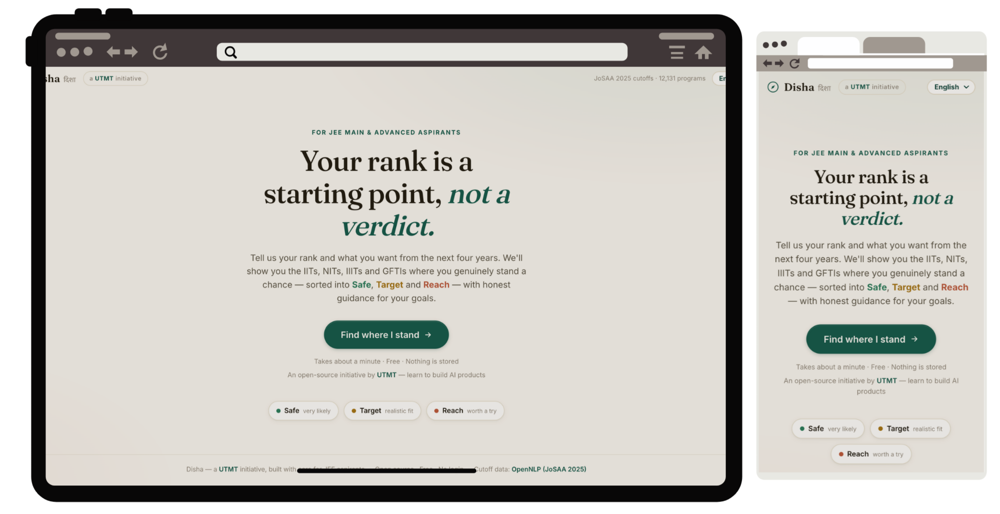

# Disha (दिशा) — JEE College Recommender & Analytics Portal

Disha is an open-source intelligent counselling pipeline and interactive portal designed to help JEE Main and Advanced aspirants navigate the complex JoSAA/CSAB seat allocation process. By inputting their ranks, gender, home state, and career aspirations, students receive a personalized, mathematically backed list of eligible college and branch options. Unlike static PDF cutoff tables, Disha groups recommendations into intuitive categories (Safe, Target, and Reach), calculates the statistical probability of admission based on historical round-wise volatility, and aligns choices with the student's career interests.

**Live Application**: [jee-college-finder-utmt-asov.onrender.com](https://jee-college-finder-utmt-asov.onrender.com/)

On the technical side, **Disha** is built as a unified **FastAPI** application in Python. The backend runs a full recommendation pipeline utilizing:
*   **2025 Merged Dataset**: Loads **12,143 cutoff rows** (all reservation categories: OPEN, OBC-NCL, SC, ST, EWS, and PwD variants) at startup from `josaa_merged_2025.csv` — cached in memory for sub-millisecond responses.
*   **Round-wise Cutoffs**: Extracts opening and closing ranks at runtime from rounds `Opening_R1…R6` / `Closing_R1…R6`.
*   **Filters** by rank type, gender pool, home-state quota, seat category, and branch tags.
*   **Scores** every option using a weighted tag-interest model per career goal.
*   **Calculates admission probability** using a sigmoid function over last-year cutoffs, adjusted by a **Volatility Penalty** derived from round-to-round movement ratio.
*   **Returns** categorised, ranked results through a clean REST API.
*   **Dataset Analytics**: Precomputes and serves detailed statistics, quota breakdowns, gender cushion multipliers, CSE cutoff premiums, and category-wise student rank availability curves via a dedicated analytics endpoint.

The frontend is pure **HTML, CSS, and vanilla JavaScript** — no frameworks — served from the same server as the API. The entire UI works in multiple languages (**English, Hindi, Gujarati, and Kannada**), switching with a single click. The API is fully documented with **Swagger UI**. The application also functions as an offline-capable **Progressive Web App (PWA)** that can be installed on mobile devices and desktops.



---

## Quick Start

1. **Set up a virtual environment and install dependencies**:
   ```bash
   # From the repository root
   python -m venv venv
   source venv/bin/activate   # On Windows: venv\Scripts\activate
   pip install -r requirements.txt
   ```

2. **Run the FastAPI application**:
   ```bash
   uvicorn main:app --reload --port 8000
   ```

3. **Access the portal**:
   - Main Recommender Portal: Open your browser and navigate to [http://127.0.0.1:8000](http://127.0.0.1:8000).
   - Statistical Insights Dashboard: Navigate to [http://127.0.0.1:8000/stats](http://127.0.0.1:8000/stats).
   - Interactive API Documentation: Available at [http://127.0.0.1:8000/api/docs](http://127.0.0.1:8000/api/docs).

*Note: On Windows, you can also double-click the `run.bat` file in the root directory to automatically set up the virtual environment, install dependencies, and launch the server.*

---

## How It Works

### 1. The Student's Journey (An Intuitive Walkthrough)

To understand how Disha thinks, let’s follow **Ayush**, a student from **Madhya Pradesh** who scored a **JEE Main CRL rank of 6,500** and is passionate about a **"Coding & software"** career. When Ayush submits his profile, Disha processes his request through five distinct stages:

*   **Stage 1: Filtering Out the Impossible**
    First, Disha looks at Ayush's exam type. Since he only entered a JEE Main rank, Disha immediately filters out all IITs (which require a JEE Advanced rank) and keeps NITs, IIITs, and GFTIs. Next, because Ayush is male, Disha filters out all female-only (supernumerary) seats. Finally, Disha checks the geographic quotas: since Ayush’s home state is Madhya Pradesh, he gets the **Home State (HS)** quota at MANIT Bhopal, but falls under the **Other State (OS)** quota for NITs in other states (like NIT Trichy or NIT Warangal).
*   **Stage 2: Sorting into Buckets (Safe, Target, Reach)**
    Disha compares Ayush’s rank of 6,500 against last year's opening and closing ranks for every remaining branch:
    *   **Reach (Ambitious)**: For *Computer Science at MANIT Bhopal*, last year's home-state cutoff window was 3,200 (Opening) to 5,800 (Closing). Ayush's rank of 6,500 is slightly past the closing rank, but since it is within a 25% margin, Disha places it in his **Reach** bucket—it's tough, but cutoffs fluctuate, so it's worth a shot.
    *   **Target (Realistic)**: For *Computer Science at NIT Jalandhar*, the cutoff window was 6,200 to 9,500. Ayush's rank of 6,500 sits comfortably inside this range, making it a highly realistic **Target**.
    *   **Safe (Backups)**: For *Civil Engineering at NIT Kurukshetra*, the cutoff window was 12,000 to 22,000. Ayush's rank of 6,500 easily beats the opening rank of 12,000. However, because Ayush is *too* overqualified (his rank is less than half of the opening rank), Disha automatically prunes this option. This keeps Ayush's list clean and prevents him from wasting choices on branches far below his potential.
*   **Stage 3: Personalizing by Career Goal**
    Ayush selected "Coding & software". Disha looks at its internal career-weight mapping: Computer Science (CSE) gets a maximum interest weight of 10, Mathematics & Computing gets 9, ECE gets 6, while Civil Engineering gets 0. 
    Disha also calculates a brand score for each college (e.g., top-tier older NITs get a higher brand weight than newer ones). Since Ayush left the **Brand-vs-Branch Slider** at the default 50/50 setting, Disha blends the branch interest score and the college brand score to calculate a personalized **Interest Score** for every option.
*   **Stage 4: Calculating Admission Probability**
    Instead of just giving a binary "yes" or "no", Disha analyzes the historical volatility of cutoffs. If a branch's closing rank has fluctuated wildly over the last few rounds, Disha calculates a wider margin of error. Using this volatility, Disha estimates Ayush's actual chance of getting in: he has a **23.5% chance** for MANIT Bhopal CSE (Reach) and an **88.2% chance** for NIT Jalandhar CSE (Target).
*   **Stage 5: Designing the Final List**
    Finally, Disha sorts Ayush’s matches. It shows all his **Targets** first (sorted by his personalized interest score), followed by his **Reaches**, and then his **Safes**. For each card, it generates a natural explanation in his chosen language: 
    > *"Target for you – strong fit for your goal (Computer Science and Engineering at NIT Jalandhar). Your home-state quota gives roughly a 1,200-rank cushion. Cutoff has been fairly steady. (88.2% chance)"*

---

### 2. Technical Detail & Core Logic

This section outlines the exact mathematical formulas, thresholds, and variables implemented in the backend pipeline (`app/disha/recommender.py` and `app/disha/states.py`).

#### A. Rank Categorization Thresholds
For a student rank $R$, opening rank $OR$, and closing rank $CR$, the category is determined by the following constants:
*   `UPPER_MARGIN = 0.25` (Allows ranks up to 25% worse than last year's closing rank to be considered a **Reach**).
*   `LOWER_MARGIN = 0.50` (Prunes any option where the student's rank is more than 50% better than the opening rank to avoid overqualification).

$$\text{Category} = \begin{cases} 
\text{None (Pruned)} & \text{if } R < OR \times (1 - \text{LOWER MARGIN}) \\
\text{Safe} & \text{if } R \le OR \\
\text{Target} & \text{if } OR < R \le CR \\
\text{Reach} & \text{if } CR < R \le CR \times (1 + \text{UPPER MARGIN}) \\
\text{None (Dropped)} & \text{if } R > CR \times (1 + \text{UPPER MARGIN})
\end{cases}$$

#### B. Personalized Scoring (Tag-Weight Model)
Each academic program is mapped to a set of semantic tags (e.g., `cse`, `ece`, `math_computing`, `mechanical`) in `states.classify_branch()`. 

When a student selects a career goal, the branch interest score ($S_{\text{branch}}$) is the maximum weight assigned to the program's tags under that goal in `states.GOAL_TAG_WEIGHTS`:

```python
# Weights from states.py
GOAL_TAG_WEIGHTS = {
    "coding":        {"cse": 10, "math_computing": 9, "ai_ds": 9, "it": 8, "ece": 6, "electrical": 4},
    "research":      {"physics": 10, "bs_science": 9, "math_science": 9, "chemistry": 8, "math_computing": 7, "economics": 6, "cse": 5, "ece": 5, "materials": 5, "mechanical": 4, "chemical": 4},
    "pure_science":  {"physics": 10, "chemistry": 10, "math_science": 10, "bs_science": 9, "biotech": 7, "materials": 4, "chemical": 3},
    "mba":           {"economics": 8, "cse": 6, "math_computing": 6, "ece": 5, "mechanical": 5, "electrical": 5, "civil": 4, "chemical": 4},
    "core":          {"mechanical": 10, "civil": 9, "electrical": 9, "chemical": 9, "aerospace": 9, "materials": 8, "energy": 8, "production": 8, "ece": 6, "cse": 3},
    "undecided":     {"cse": 7, "ece": 7, "math_computing": 7, "ai_ds": 7, "electrical": 6, "mechanical": 6, "chemical": 5, "civil": 5, "it": 6, "economics": 5}
}
```

The institute brand score ($S_{\text{brand}}$) is determined by the tier of the college in `data_loader._brand_score()`:
*   **Old IITs** (`_OLD_IITS`): `1.0`
*   **Newer IITs**: `0.88`
*   **Top NITs** (`_TOP_NITS`): `0.78`
*   **Other NITs**: `0.68`
*   **IIITs**: `0.60`
*   **GFTIs**: `0.50`

The final interest score ($S_{\text{interest}}$) blends these two components using the user's brand-vs-branch ratio slider $\alpha \in [0.0, 1.0]$:

$$S_{\text{interest}} = (1 - \alpha) \times S_{\text{branch}} + \alpha \times (S_{\text{brand}} \times 10)$$

#### C. Admission Probability & Volatility
The probability of admission $P$ is calculated using a logistic sigmoid function of the Z-score and adjusted by a Volatility Penalty:

$$P_{\text{base}} = \frac{1}{1 + e^{-1.7 \cdot z}} \times 100\%$$

Where the Z-score $z$ represents how many standard deviations the student's rank is from the closing rank:

$$z = \frac{CR - R}{\sigma}$$

*   **Volatility ($\sigma$)**:
    *   Since multi-year history has been removed, volatility defaults to a baseline of $8\%$ of the closing rank:
        $$\sigma = 0.08 \times CR$$
    *   To prevent zero or low spreads, a minimum floor is enforced:
        $$\sigma_{\text{min}} = \max(10, 0.05 \times CR)$$

*   **Volatility Penalty**:
    A penalty is deducted from the base probability based on the program's round-to-round **movement ratio** to account for vacancy fluctuations:
    $$\text{penalty} = \min(0.2, \text{movement\_ratio} \times 0.3)$$
    $$P = \max(0.0, P_{\text{base}} - \text{penalty} \times 100)$$

#### D. Cutoff Confidence & Volatility Tags
Cutoffs are classified dynamically by analyzing the round-wise closing ranks (`Closing_R1...R6`) of 2025 using `compute_stable_and_volatility()`:
*   **Stable Cutoff**: Computed as the median of the last 4 valid round closing ranks (if $\ge 4$ valid rounds exist), otherwise the median of all valid rounds.
*   **Movement Ratio**: $\text{total\_movement} / \text{stable\_cutoff}$ (where total movement is the sum of consecutive round-to-round deltas).
*   **Jump Concentration**: $\text{max\_single\_jump} / \text{total\_movement}$.
*   **Classifications**:
    *   **Highly Stable** (`highly_stable`): Movement ratio $< 0.05$ (highly stable across all rounds).
    *   **Stable — Predictable Drift** (`stable_drift`): Movement ratio $< 0.20$ and jump concentration $< 0.5$.
    *   **Volatile — Vacancy-Driven** (`volatile_vacancy`): Jump concentration $\ge 0.5$ and movement ratio $\ge 0.20$ (includes the round number of the largest jump).
    *   **Volatile — Erratic** (`volatile_erratic`): Erratic fluctuations across rounds.

#### E. Sorting Hierarchy
Recommended programs are sorted by a tuple containing five keys:
1.  **Category Order**: `Target` (0) $\to$ `Reach` (1) $\to$ `Safe` (2).
2.  **Interest Score**: Descending (aligning with career goals and the brand/branch slider).
3.  **Closing Rank**: Ascending (placing more competitive branches first).
4.  **Institute Name**: Alphabetically (A-Z).
5.  **Branch Name**: Alphabetically (A-Z).

#### F. Preparatory Ranks (PwD candidates) Handling
For candidates applying under PwD categories, JoSAA issues **Preparatory ranks** (suffixed with a trailing 'P', e.g. `151P`, `2P`) when candidates score below the standard cutoff but meet the bridge-course criteria. To prevent these distinct rank scales from corrupting standard statistics:
*   **Detection & Separation**: `_split_col_by_suffix()` detects P-suffixed cells, strips the suffix, and stores them in separate `preparatory_opening_rank` and `preparatory_closing_rank` columns.
*   **Pruning**: Pure preparatory rows (where all round entries are preparatory) are excluded from the main recommender pipeline to prevent mismatched rank recommendations.

---

## API Reference

### GET `/api/health`
Returns the status of the API and the number of loaded programs.

**Response Body (`MetaResponse`)**:
```json
{
  "status": "ok",
  "programs": 12143
}
```

---

### GET `/api/meta`
Returns metadata required to populate the frontend form dropdowns and sliders.

**Response Body (`MetaResponse`)**:
```json
{
  "states": ["Andhra Pradesh", "Rajasthan", "..."],
  "goals": [
    { "value": "coding", "label": "Software / coding career" },
    { "value": "pure_science", "label": "Pure Science (Physics, Chemistry, Maths)" },
    { "value": "research", "label": "Research / higher studies" },
    "..."
  ],
  "genders": ["male", "female"],
  "categories": [
    { "value": "OPEN", "label": "OPEN (General / CRL)", "available": true },
    { "value": "OBC-NCL", "label": "OBC-NCL", "available": true },
    "..."
  ],
  "branches": [
    { "value": "cs_it", "label": "CS / IT" },
    "..."
  ],
  "total_programs": 12143,
  "data_mode": "basic",
  "allow_toggle": false,
  "extended_available": false
}
```

---

### GET `/api/stats`
Returns dynamically computed statistical insights and distributions on the active dataset.

**Response Body**:
```json
{
  "summary": {
    "total_records": 12143,
    "unique_institutes": 118,
    "unique_programs": 150,
    "unique_quotas": 6,
    "unique_seat_types": 10,
    "unique_genders": 2
  },
  "inst_type_counts": { "IIT": 3200, "NIT": 5000, "IIIT": 2500, "GFTI": 1443 },
  "state_counts": { "Rajasthan": 1200, "Bihar": 800, "...": 0 },
  "quota_counts": { "AI": 5000, "HS": 3500, "OS": 3500, "...": 143 },
  "seat_type_counts": { "OPEN": 6000, "OBC-NCL": 3000, "...": 0 },
  "gender_counts": { "Gender-Neutral": 9000, "Female-only": 3143 },
  "round_averages": { "Closing_R1": 15200.5, "Closing_R6": 17800.2 },
  "highest_cutoffs": [
    {
      "institute": "Indian Institute of Technology Bombay",
      "program": "Computer Science and Engineering (4 Years, Bachelor of Technology)",
      "quota": "AI",
      "gender": "Gender-Neutral",
      "opening_rank": 1,
      "closing_rank": 68,
      "inst_type": "IIT"
    }
  ],
  "lowest_cutoffs": [ ... ],
  "inst_competitiveness": {
    "IIT": [
      {
        "institute": "Indian Institute of Technology Bombay",
        "avg_closing_rank": 540.2,
        "min_opening_rank": 1,
        "total_programs": 15
      }
    ],
    "...": []
  },
  "top_programs_by_type": { ... },
  "popular_branches": [ ... ],
  "volatility_counts": {
    "highly_stable": 5420,
    "stable_drift": 3200,
    "volatile_vacancy": 1800,
    "volatile_erratic": 1723
  },
  "gender_advantage": [
    {
      "inst_type": "IIT",
      "avg_multiplier": 1.45,
      "avg_rank_difference": 3200.5
    }
  ],
  "cse_premium": [
    {
      "inst_type": "IIT",
      "cse_avg": 2500.5,
      "non_cse_avg": 7800.3,
      "overall_avg": 6200.1,
      "cse_programs": 23,
      "non_cse_programs": 95
    }
  ],
  "top_branches_by_type": { ... },
  "duration_comparison": [ ... ],
  "rank_availability": {
    "advanced": [
      { "rank": 500, "total_programs": 4, "total_institutes": 2 }
    ],
    "mains": [ ... ],
    "advanced_by_category": { "OPEN": [ ... ], "OBC-NCL": [ ... ] },
    "mains_by_category": { ... }
  }
}
```

---

### POST `/api/recommend`
Submits a student profile and returns filtered, categorized, and sorted recommendations.

**Request Body (`RecommendRequest`)**:
```json
{
  "adv_rank": 1500,
  "mains_rank": 6000,
  "gender": "female",
  "home_state": "Rajasthan",
  "goal": "coding",
  "data_mode": "basic",
  "seat_category": "OPEN",
  "brand_branch_ratio": 0.5,
  "branch_preferences": ["cs_it", "ece"],
  "max_results": 60,
  "lang": "en"
}
```

*   `adv_rank` (integer, optional): JEE Advanced CRL rank. Required to see IITs.
*   `mains_rank` (integer, optional): JEE Mains CRL rank. Required to see NITs/IIITs/GFTIs.
*   `gender` (string): `male` | `female`.
*   `home_state` (string): Must match one of the canonical Indian states.
*   `goal` (string): `coding` | `research` | `pure_science` | `mba` | `core` | `undecided`.
*   `data_mode` (string, optional): Default `"basic"`. ("extended" is accepted for backwards compatibility).
*   `seat_category` (string, optional): Must match a canonical JoSAA category (e.g. `OPEN`, `OBC-NCL`, `SC`, `ST`, `EWS`).
*   `brand_branch_ratio` (float, optional): Priority slider value between `0.0` and `1.0`.
*   `branch_preferences` (array of strings, optional): List of branch family codes to filter by.
*   `max_results` (integer, optional): Maximum recommendations to return (default 60, max 300).
*   `lang` (string, optional): `en` | `hi` | `gu` | `kn`.

**Response Body (`RecommendResponse`)**:
```json
{
  "guidance": "Found 45 eligible institute-branch options...",
  "interest_guidance": "Since you are aiming for a software/coding career...",
  "counts": {
    "total": 45,
    "shown": 45,
    "by_category": { "Target": 20, "Reach": 10, "Safe": 15 },
    "by_type": { "IIT": 10, "NIT": 20, "IIIT": 10, "GFTI": 5 }
  },
  "notes": [],
  "category_guidance": [
    { "category": "Target", "count": 20, "blurb": "These match your rank closely..." }
  ],
  "recommendations": [
    {
      "institute": "National Institute of Technology, Jalandhar",
      "institute_type": "NIT",
      "institute_state": "Punjab",
      "exam": "mains",
      "branch": "Computer Science and Engineering",
      "branch_full": "Computer Science and Engineering (4 Years, Bachelor of Technology)",
      "degree": "Bachelor of Technology",
      "quota": "OS",
      "gender_pool": "neutral",
      "opening_rank": 6200,
      "closing_rank": 9500,
      "category": "Target",
      "fit_label": "Achievable - your rank lies within last year's opening to closing range.",
      "interest_score": 8.9,
      "matched_interest": true,
      "home_state_advantage": null,
      "female_seat_advantage": null,
      "confidence": "medium",
      "reason": "Target for you – strong fit for your goal (Computer Science and Engineering at an NIT)...",
      "region": "north",
      "is_metro": false,
      "history": { "2025": 9500 },
      "admission_probability": 88.2
    }
  ]
}
```

---

## Project Structure

```text
jee-college-finder-utmt/
├── main.py                       # FastAPI server & portal entry point
├── requirements.txt              # Python package dependencies
├── render.yaml                   # Render deployment configuration
├── run.bat                       # Windows quick launch script
├── conftest.py                   # Pytest configuration and fixtures
├── .gitignore                    # Git ignore file
├── LICENSE                       # Project license
├── README.md                     # Project documentation (this file)
├── app/
│   └── disha/
│       ├── __init__.py
│       ├── config.py             # Configuration for backend variables
│       ├── data_loader.py        # Core data loading and processing logic
│       ├── recommender.py        # Recommendation engine algorithm
│       ├── routes.py             # APIRouter for sub-app integration
│       ├── schemas.py            # Pydantic data models for validation
│       ├── states.py             # State mappings and career weights
│       ├── stats_loader.py       # Statistics generation and data analysis
│       └── data/                 # Data storage for backend
│           └── josaa_merged_2025.csv # Primary college dataset
├── Data/                         # Scripts and notebooks for data preprocessing
│   ├── analysis.ipynb            # Jupyter notebook for exploratory data analysis
│   ├── analyze_criteria.py       # Script for specific criteria analysis
│   ├── clean.py                  # Data cleaning and formatting script
│   ├── jee_cutoff_last_round.csv # Raw JEE cutoff dataset
│   └── josaa_merged_2025.csv     # Cleaned dataset (source for app data)
├── templates/
│   └── disha_templates/          # Web UI codebase
│       ├── index.html            # Main recommender portal frontend
│       ├── stats.html            # Statistics dashboard frontend
│       ├── manifest.json         # PWA manifest file
│       ├── sw.js                 # Service worker for offline capabilities
│       ├── assets/               # Static assets and icons
│       │   └── favicon.svg       # Website favicon
│       ├── css/                  # Stylesheets
│       │   └── style.css         # Core visual styling & responsive rules
│       └── js/                   # Component modules
│           ├── api.js            # API client for backend communication
│           ├── app.js            # Main frontend application logic
│           ├── config.js         # API URL resolver and configurations
│           └── i18n.js           # Internationalization/localization setup
└── tests/                        # Automated test suite
    ├── test_api.py               # Tests for REST API endpoints
    ├── test_enhancements.py      # Tests for specific enhanced features
    └── test_recommender.py       # Tests for recommendation engine accuracy
```

---

## Portal Integration

To deploy **Disha** on the master UTMT portal, integrate it as a FastAPI sub-app matching the existing format:

### 1. Backend Integration (Router)
Include the disha router from `app/disha/routes` using the desired URL prefix:
```python
from app.disha.routes import router as disha_router

# Include API routes & clean-URL page routes
app.include_router(disha_router, prefix="/learning_games", tags=["learning_games"])
```

### 2. Frontend Integration (Static Files Mount)
Mount the static templates directory under the same URL prefix:
```python
from fastapi.staticfiles import StaticFiles
from pathlib import Path

DISHA_TEMPLATES_DIR = Path(__file__).resolve().parent / "templates" / "disha_templates"
app.mount(
    "/learning_games",
    StaticFiles(directory=str(DISHA_TEMPLATES_DIR), html=True),
    name="disha",
)
```

### 3. Merging Dependencies
Ensure the following packages are merged into the main portal's `requirements.txt`:
```text
pandas>=2.3.1
openpyxl==3.1.5
aiofiles==23.2.1
pydantic==2.7.4
```

---

## Configuration

The application settings are statically configured inside `app/disha/config.py` using the `Settings` class:

| Setting | Type & Default | Description |
|---------|----------------|-------------|
| `cors_origins` | `str = "*"` | Comma-separated list of origins allowed to make API requests, or `*` for all. |
| `data_path` | `str = "app/disha/data/JEE_2025_Cutoffs.xlsx"` | Path to the legacy Excel cutoff workbook (kept for reference). |
| `basic_merged_data_path` | `str = "app/disha/data/josaa_merged_2025.csv"` | Path to the 2025 round-wise merged CSV containing all categories and rounds. |
| `data_mode` | `str = "basic"` | Active data mode. Defaults to `"basic"`; extended mode has been fully removed. |

---

## Testing

The test suite is located in the `tests/` directory and can be run using `pytest`.

*   **`tests/test_api.py`**: Integration tests for the HTTP API layer. Verifies that the `/api/health` and `/api/meta` endpoints return correctly structured responses, that the `/api/recommend` endpoint filters and sorts results, and that invalid inputs or languages are rejected with the correct status codes (e.g., `422`).
*   **`tests/test_recommender.py`**: Unit tests for the core recommendation pipeline. Verifies rank selection, gender-pool filtering, home-state and other-state quota matching, rank categorization boundary conditions, overqualification pruning, and language-specific text generation.
*   **`tests/test_enhancements.py`**: Unit tests verifying geographic region classification, metro status, and the mathematical correctness of the ratio-blended interest scoring model.

To run all tests, activate the virtual environment and execute:
```bash
pytest tests/ -v
```

---

## Data Sources

Cutoffs are sourced from the [atmabodha/OpenNLP JEE dataset](https://github.com/atmabodha/OpenNLP) (JoSAA 2025, Round 6 closing ranks), published by UTMT. This tool is for guidance only and does not guarantee admission outcomes.

---

## License

This project is licensed under the MIT License. See the [LICENSE](LICENSE) file for details.
